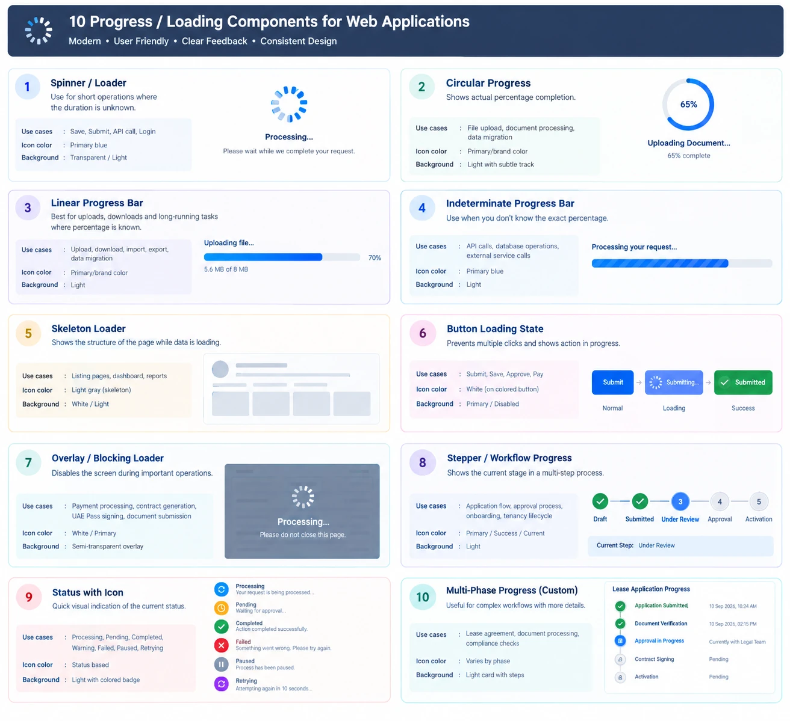
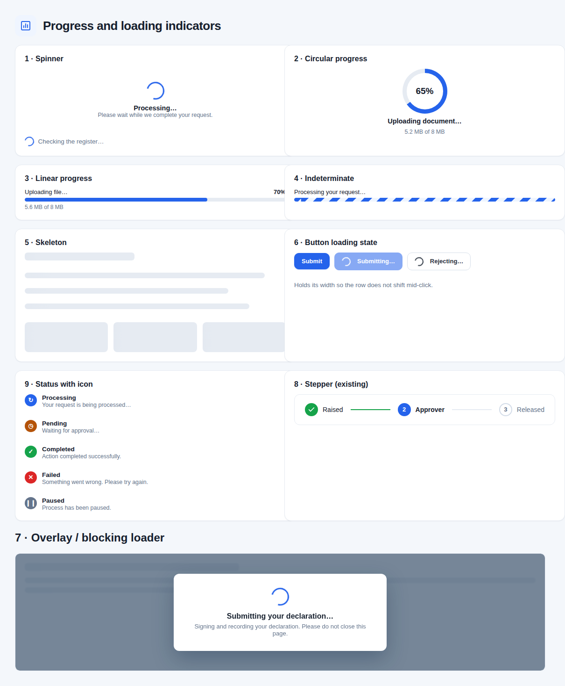

# Progress and loading indicator standard

The application uses standardised progress and loading indicators consistently across the system.
The indicator is chosen by the **nature, duration and measurability** of the operation.

Each indicator must give clear visual feedback that the system is processing the request and, where
possible, communicate the current status or percentage of completion.

## Selection rules

| Scenario | Indicator | Rationale |
| --- | --- | --- |
| Short operation with unknown duration | Spinner / Loader | Immediate feedback that the system has the request. |
| Operation with known percentage | Linear Progress Bar | Communicates actual progress. |
| File upload / download | Linear or Circular Progress | Shows what is done and what remains. |
| Long operation, percentage unknowable | Indeterminate Progress Bar | Says processing continues when no accurate percentage exists. |
| Loading page / content / data | Skeleton Loader | Lets the reader understand the coming structure while data is retrieved. |
| Save / Submit / Approve / Pay | Button Loading State | Prevents duplicate clicks and shows the action is in progress. |
| Critical or blocking operation | Overlay / Blocking Loader | Stops interaction while an operation must complete. |
| Multi-step business process | Stepper / Workflow Progress | Shows the current stage and the ones remaining. |
| Processing / Pending / Completed / Failed | Status Icon with Label | Immediate, understandable indication of state. |
| Complex or long-running workflow | Multi-Phase Progress | Shows individual stages and their status. |

## Design principle

The application must **not use one loading indicator for every scenario**. The indicator fits the
operation, and is used **where there is a meaningful need to communicate activity, progress, waiting
or status**.

The reader should be able to tell: what is happening; whether the system is still working; how much
is done, where measurable; what stage the process is at; whether they must wait or act; and whether
it succeeded or failed.

Indicators must prevent unintended duplicate actions, particularly for **Submit, Save, Approve,
Payment, Signing and other transactional operations**.

---

## What the app had before this

Three of the ten, and a lot of bare text:

- **Linear and indeterminate bars** existed as `cg-progress-track` / `cg-progress-fill`, used on one
  screen (the user-list upload).
- **The stepper** existed as `cg-stepper`, used by the declaration wizards and the RP Transaction
  stage rail.
- **`Loading…`** in muted italics — 34 occurrences across 32 files — stood in for the spinner and
  the skeleton alike.
- **26 buttons** disabled themselves on a busy flag with no spinner and no change of label, so a
  transactional action in flight looked like a dead control.

Nothing else: no spinner, no circular progress, no skeleton, no blocking overlay, no status icon.

## What is built

| # | Indicator | Component | Notes |
| --- | --- | --- | --- |
| 1 | Spinner | `CgSpinner`, `CgBusy` | `CgBusy` is the spinner with a line of text beside it. A spinner alone says "busy"; the line says what it is busy with. |
| 2 | Circular progress | `CgCircularProgress` | One element, a `conic-gradient` driven by a custom property — no SVG, nothing computing a dash array. |
| 3 | Linear progress | `CgProgressBar` with `Percent` | Label, percentage and a detail line ("5.6 MB of 8 MB"). |
| 4 | Indeterminate | `CgProgressBar` with `Percent` null | The same component. Null draws the stripes: the bar moves without claiming a position. |
| 5 | Skeleton | `CgSkeleton` | Three shapes — table, cards, list. `aria-hidden`, with a live region announcing the wait. |
| 6 | Button loading state | `CgBusyButton` | See below. |
| 7 | Blocking overlay | `CgBlockingOverlay` | `role="alertdialog"`, `aria-modal`. |
| 8 | Stepper | `cg-stepper`, `RpStageRail` | Already existed. |
| 9 | Status with icon | `CgStatus` | Seven states, each a glyph **and** a colour, so it survives greyscale printing and colour blindness. |
| 10 | Multi-phase | `RpTimeline` | Already existed as the RP Transaction history: phases, each with actor, time and outcome. |

### `CgBusyButton` is the one that carries the standard's last paragraph

The guard belongs to the component, not the caller. Every screen that wrote `disabled="@_saving"`
had to set and clear that flag on every path, and a validation failure that returned early left the
button stuck. `CgBusyButton` is busy for exactly as long as the handler's task, however it ends —
including when it throws.

It also checks its own flag rather than trusting `disabled`: a fast double click can land both
events before the re-render applies the attribute, which is precisely the duplicate submit the
standard is about. And it pins its width before the label changes, so the row does not shift under
the cursor mid-click.

## Where it is applied

| Screen | Was | Now |
| --- | --- | --- |
| Insider declaration — submit | Button disabled, label swapped to "Saving…" | `CgBusyButton` + blocking overlay |
| RP & COI declaration — submit | Same | `CgBusyButton` + blocking overlay (it signs the declaration) |
| RP Transaction — raise | Button disabled | `CgBusyButton` + blocking overlay |
| RP Transaction — approver decisions | Four buttons disabled on one flag | Four `CgBusyButton`s, each naming its verb |
| RP Transaction — CCAO decisions and release | Buttons disabled | `CgBusyButton` |
| RP Transaction — my transactions, both queues | `Loading…` | `CgSkeleton` |
| Insider declaration — ID and licence uploads | Bare `<progress>` and "Uploading… 40%" | `CgProgressBar` with label, percentage and detail |
| Insider declaration — "Read details" (Azure OCR) | Label swapped to "Reading…" | Spinner beside the label |
| CCAO — minutes upload | The word "Uploading…" | `CgProgressBar`, streamed in chunks so the percentage is real |

## Not yet applied

**`Loading…` still stands in about 28 other places** — the admin lists, the reports, My Register,
the dashboard. Each wants a `CgSkeleton` shaped like the thing it is waiting for, which is a
judgement per screen rather than a find-and-replace, so they were left rather than swapped blind.

**`CgCircularProgress` and `CgStatus` have no caller yet.** They are built and rendered above, but
the places that want them — a large upload card, a status panel — do not exist on any screen today.
Built anyway, so the standard is complete and the next screen that needs one does not invent it.

**The remaining ~20 disabled-on-flag buttons** outside the RP Transaction and declaration paths are
not transactional in the standard's sense (they save reference data). They should still move to
`CgBusyButton`, but nothing is at risk while they have not.
