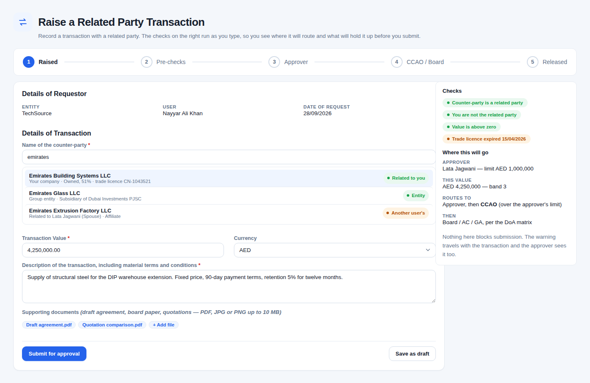
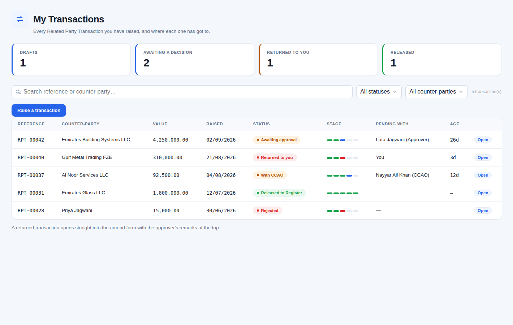
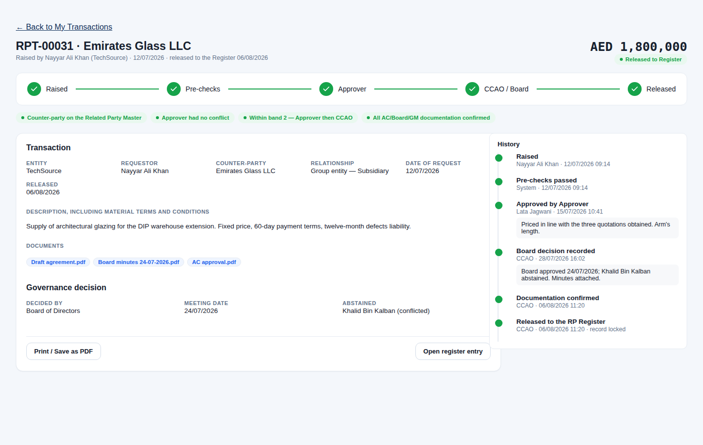
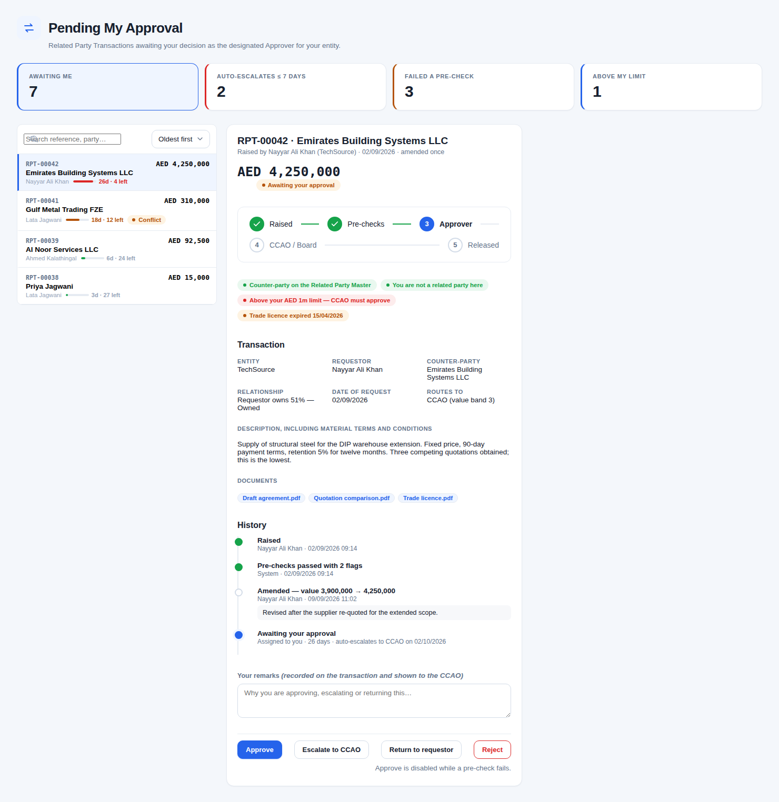
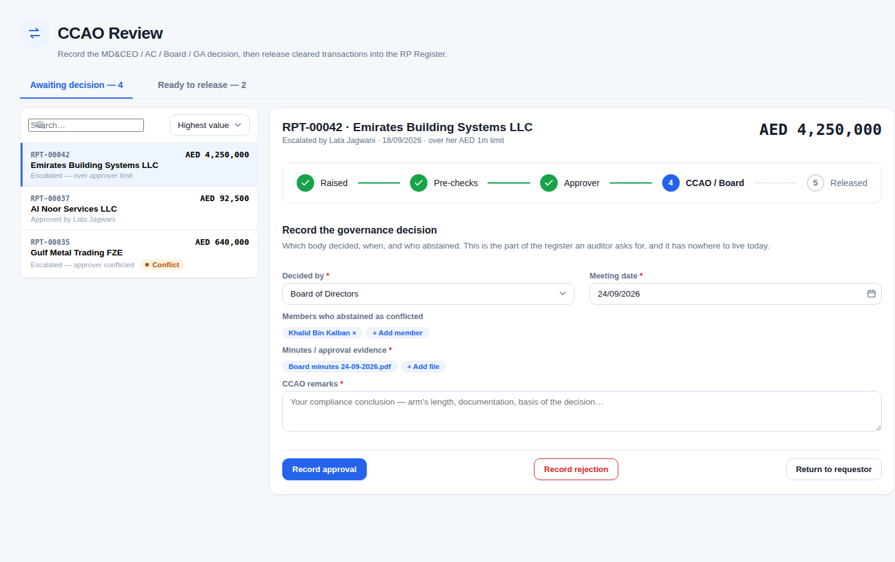
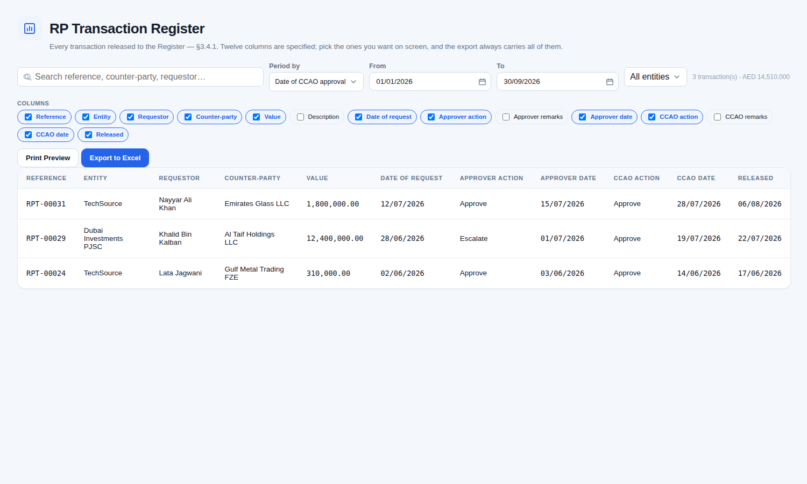
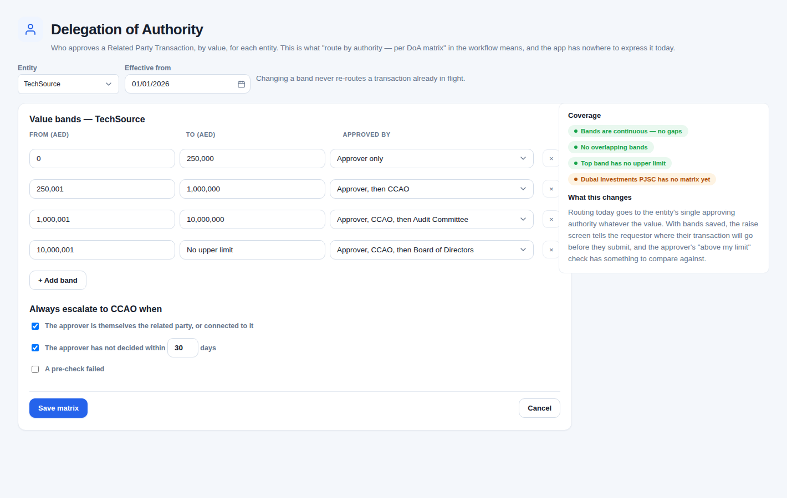

# RP Transaction — proposed design

A proposal, not a record of what exists. The specs beside it
([workflow](rp-transaction-workflow.md), [field rules](rp-transaction-field-rules.md),
[notifications](rp-transaction-notifications.md), [reports](rp-transaction-reports.md))
say what the Dec 2018 document asked for; this says what the screens should be, and
where the app falls short of that today.

Every screen below was drawn against the app's own `app.css`, so what is pictured is
what the design system already renders. The classes the mockups add are collected in
[rp-transaction-design.css](rp-transaction-design.css) and listed at the end.

---

## Where the app stands

The **forms are faithful** to §3.2. Field-by-field, the four screens capture what the
spec asks for, with the right things auto-filled and non-editable, and Form 4's checkbox
gates Release exactly as written. The register meets both of §3.4.1's notes — CSV export,
and a period filter on any of the three date bases. Documents and the 30-day
auto-escalation go beyond the spec, sensibly.

Two kinds of problem sit on top of that.

### Four gaps against the workflow diagram

1. **"Route by authority — per DoA matrix" does not exist.** Routing goes to
   `Company.ApprovingAuthorityMemberId` — one approver per entity, no value bands. The
   diagram's "escalate: over limit" cannot happen; `RpEscalationReason` has
   `ManualByApprover`, `AutoTimeout30Days` and `ApproverConflictOfInterest`, and no
   over-limit. An AED 50,000 transaction and an AED 50,000,000 one take the same path.

2. **"System pre-checks: RP match, conflict, value" does not exist.** The counter-party
   is a free dropdown. Nothing verifies the counter-party *is* a related party of this
   requestor, nothing notices that the approver is themselves the related party, nothing
   compares the value to an authority.

3. **"Returned to user — amend and resubmit" is not reachable.** Amend exists, but the
   approver has only Approve / Escalate / Reject. There is no `Returned` status, so "fix
   this and resubmit" has to be done as a rejection — which loses the thread.

4. **The Board / AC / GA decision is not recorded.** CCAO Approve/Reject is a single
   flag. Which body decided, on what date, and who abstained as conflicted — the thing an
   auditor asks for first — has nowhere to live.

### One UI problem, bigger than any of them

`/rp-transactions/approvals` and `/ccao-review` render **every pending transaction as a
full stacked form**. Ten items is ten forms down one page: no search, no sort, no filter,
no sense of how long anything has waited. And **nothing anywhere shows one transaction's
history** — who did what, when, with what remarks. For a governance tool that history is
the central artifact, and today it exists only in the audit log, which is not where
anyone reviewing a transaction is looking.

---

## Design principles

1. **The workflow is the interface.** The five stages appear as a rail on every screen
   that touches a transaction, so nobody has to remember where a thing is.
2. **Show the checks, don't hide them.** A rule that silently routes or silently blocks
   is a rule nobody trusts. Every check states itself, in words, with its consequence.
3. **A queue is a list, not a stack of forms.** Choose, then act.
4. **One transaction, one page.** Its whole life on one screen, readable by someone who
   was not part of it.
5. **Never lose the thread.** Returned is a state, not a rejection. Amendments are
   recorded with before and after.

---

## 1. Raise a transaction — `/rp-transactions/new`

**What changes.** The counter-party dropdown becomes a search that says *why* each
result is a related party — "Your company · Owned, 51%", "Related to Lata Jagwani
(Spouse)", "Group entity". The requestor stops guessing whether the name they picked is
the right one.

The panel on the right runs the §3.1 pre-checks as the form is filled and, crucially,
**says where the transaction will go before it is submitted**: which approver, which
value band, and whether it will need the CCAO. Today the requestor submits into silence.

Warnings do not block submission — they travel with the transaction, and the approver
sees the same chips. Only a genuine failure (no counter-party, zero value) stops Submit.

**Needs:** the DoA matrix (screen 7) for the routing preview; the Related Party Master
for the relationship line.

---

## 2. My Transactions — `/rp-transactions/mine`

**What changes.** A **stage mini-rail** per row — five dashes, coloured by state — so
progress is legible without opening anything. A red dash is a stop: rejected, or returned.

Counts across the top double as filters. **Returned to you** is its own count, because it
is the only state that needs the requestor to act.

Amend stops being a form that unfolds inside a table row. A returned transaction opens
into the detail page with the approver's remarks at the top.

---

## 3. Transaction detail — `/rp-transactions/{reference}` *(new)*

**The screen the app has no equivalent of.** One transaction, its facts, its documents,
the governance decision behind it, and a complete history: who did what, when, and what
they said. Readable by someone who was not part of it — which is exactly what an audit
is.

Every other screen links here. Requestor, approver, CCAO and auditor see the same page;
only the action panel differs by who is looking.

**Needs:** nothing new in the schema. `ApproverRemarks`, `CcaoRemarks`,
`ApproverActionAtUtc`, `CcaoActionAtUtc`, `AmendmentCount` and the audit log already hold
everything the timeline shows, except the governance-decision block (screen 5).

---

## 4. Approver queue — `/rp-transactions/approvals`

**What changes.** Queue on the left, one detail on the right. The stack of forms goes.

- **SLA meter** on every row — "26d · 4 left". The 30-day auto-escalation already runs;
  nobody can currently see it coming.
- **Pre-checks as chips**, with their consequence spelled out: *above your AED 1m limit —
  CCAO must approve*. Approve is disabled while one fails, and the chip says why.
- **Return to requestor** joins Approve / Escalate / Reject (gap 3).
- Counts across the top are the filters — *auto-escalates ≤ 7 days*, *failed a
  pre-check*, *above my limit*.

Deliberately **not** included: bulk approve. Individual remarks per transaction look like
a governance requirement rather than a convenience, and that is a decision to take
explicitly, not to inherit from a mockup.

---

## 5. CCAO review — `/rp-transactions/ccao-review`

**What changes.** Same queue-and-detail shape, plus the block that closes gap 4: **which
body decided, on what date, who abstained as conflicted, and the minutes**. §3.2 section 3
is the CCAO recording an offline decision; at the moment the app records only that a
decision happened.

The queue row says *why* each item arrived — "escalated, over approver limit",
"escalated, approver conflicted", "approved by Lata Jagwani" — which changes what the
CCAO is being asked to do.

The second tab (Ready to release) keeps Form 4 exactly as specified: the documentation
checkbox, and the Release button gated on it alone.

**Needs:** four new columns on `RelatedPartyTransaction` — deciding body, meeting date,
abstentions, and minutes as a document.

---

## 6. RP Transaction Register — `/rp-transactions/register`

**What changes, and what does not.** The filters and the export already satisfy §3.4.1
and stay as they are. What is added is a **column picker**: the spec names twelve columns,
the export carries all twelve, and the screen currently shows nine — *Description*,
*Approver Remarks* and *CCAO Remarks* are left out because they are long free text in an
already-wide table.

A picker settles that without making the default unusable: the three stay off by default
and anyone who needs them turns them on. The same pattern the RP & COI report already
uses.

A running total beside the record count, because a register of transactions is usually
being read for the total.

---

## 7. Delegation of Authority — `/admin/doa-matrix` *(new)*

**The largest piece, and the one that unblocks the others.** Per entity, value bands map
to an approval path; below the bands, the conditions that always escalate to the CCAO —
approver conflicted, approver silent for N days, pre-check failed. Two of those three are
already in `RpEscalationReason`; this is where they stop being hard-coded.

The coverage panel refuses to let the matrix be wrong in the ways that matter: gaps
between bands, overlaps, a top band with a ceiling, and entities with no matrix at all.

A saved matrix is what makes screen 1's routing preview and screen 4's "above my limit"
check possible. Until it exists, both are guesses.

**Needs:** a new table (entity, effective-from, bands, escalation conditions), its
stored procedures per the repo's write convention, and routing in
`RelatedPartyTransactionWriter` that reads it.

---

## What the schema needs

| Screen | Change | As built |
| --- | --- | --- |
| 3 | none | none |
| 4 | `RpTransactionStatus.Returned`; `RpEscalationReason.OverApproverLimit` | both, plus `RpApproverAction.Return` — all appended enum members, stored as ints |
| 5 | `GoverningBody`, `GoverningBodyDecisionDate`, `AbstainedMemberIds`, minutes document kind | `GoverningBody`, `GoverningBodyDecisionDate`, `AbstainedMembers` (names, not ids — a board member need not be a user of this system), `RelatedPartyTransactionDocuments.Kind` |
| 7 | `DelegationOfAuthorityBand` table + `usp_DoaBand_*` procedures | `DelegationsOfAuthority` (one per entity, carrying the approver limit and the escalation settings) and `DelegationOfAuthorityBands`, saved whole by `usp_DelegationOfAuthority_Save` |
| 1, 4 | none beyond the above — pre-checks are computed, not stored | as proposed |

Everything else is UI over data the model already holds.

## New CSS

All in [rp-transaction-design.css](rp-transaction-design.css), all additive — no existing
class changes behaviour:

| Class | What it is |
| --- | --- |
| `cg-workbench`, `cg-queue`, `cg-queue-item` | Queue-and-detail layout |
| `cg-sla`, `cg-sla-track`, `cg-sla-fill` | Age against the auto-escalation deadline |
| `cg-checks`, `cg-check[data-state]` | Pre-check chips, pass / warn / fail |
| `cg-timeline` | One transaction's history |
| `cg-facts`, `cg-fact-label`, `cg-fact-value` | Read-only field grid |
| `cg-action-bar` | Sticky decision bar |
| `cg-minirail` | Five-dash stage indicator for table rows |
| `cg-colpick` | Column picker chips |
| `cg-band` | DoA band row |
| `cg-sidepanel`, `cg-form-split`, `cg-combo-hit` | Supporting layout |

The stage rail reuses `cg-stepper` / `cg-step` from the COI declaration unchanged.

## Build order

| | Work | Schema? | Why here | |
| --- | --- | --- | --- | --- |
| 1 | Transaction detail + timeline (screen 3) | no | Everything links to it; pure UI | **done** |
| 2 | Queue + detail on both review screens (4, 5) | no | Biggest usability win | **done** |
| 3 | `Returned` status and the Return action | small | Closes a flow gap | **done** |
| 4 | Register column picker (6) | no | An hour's work | **done** |
| 5 | Pre-checks (1, 4) | no | Needs the Related Party Master settled | **done** |
| 6 | DoA matrix (7) + value routing | yes | Largest; unblocks routing and limits | **done** |
| 7 | Governance decision block (5) | yes | Audit completeness | **done** |

All seven are built.

**To deploy:** apply the EF migration `AddDelegationOfAuthorityAndGovernanceDecision` (the app does
it at startup, or `dotnet ef database update`), then run `scripts/stored-procedures.sql` — in that
order, as its own schema guard insists. The guard was extended to check the new tables and columns.

Two things changed from the proposal as it was built:

**The approver's limit is its own setting, not a band.** The mockup showed "above your AED 1m limit"
and the bands in the same breath, but they answer different questions: the bands say which body must
ultimately approve a transaction of this size, and the limit says whether the approver is in the
path at all. A transaction above the limit is routed to the CCAO at submission and never reaches the
approver — that is `RpEscalationReason.OverApproverLimit`, the workflow's "escalate: over limit",
which previously had no way of happening.

**"Escalate when a pre-check failed" was dropped from the matrix.** It could never fire: a failing
pre-check is one of the two the form already refuses to submit on. A switch that does nothing is
worse than an absent one, so the two triggers that do work — approver conflicted, and a per-entity
deadline the escalation job now reads — are what the screen offers.

## Decisions needed before building

1. **What are the DoA value bands, per entity?** Screen 7 cannot be specified without
   them, and screens 1 and 4 depend on it.
2. ~~**Where does the counter-party list come from?**~~ **Settled: the standing Related Party
   Master**, which is what §3.2 names. The dropdown and the pre-checks now read the same source, so
   they agree. Names that only a submitted declaration ever held are still offered, under a
   "Declared elsewhere" group — a declarant can decline the "update My Register?" prompt, and a
   name that used to be selectable must not silently stop being selectable. This also removed the
   setup blocker: a deployment with no submitted declarations had an empty dropdown and could not
   raise a transaction at all.
3. **May an approver bulk-approve?** Left out above on purpose.
4. **Is "latest version" in §3.3 intended?** Read literally, a notification is a live
   view rather than a record of what was sent, so a stage 1 email opened after stage 3
   shows stage 3's values.
