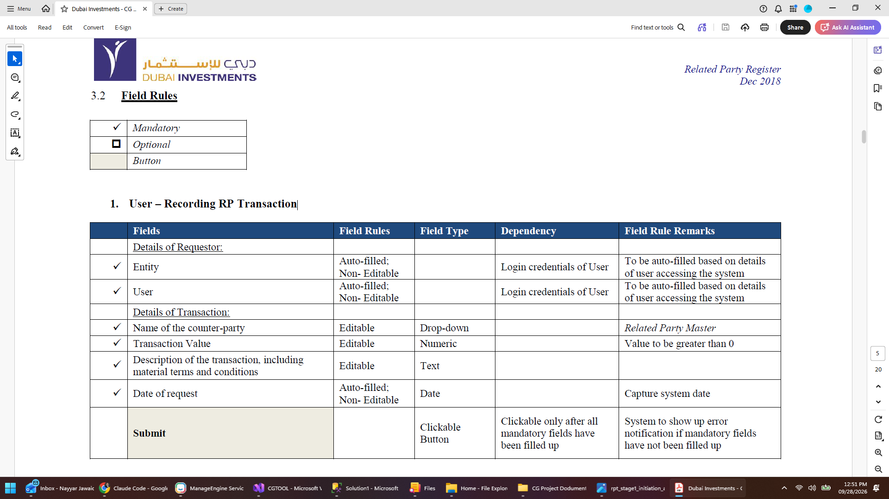

# RP Transaction field rules

From **Related Party Register, Dec 2018**, §3.2 "Field Rules" — the field-by-field
specification behind the RP Transaction screens. Transcribed rather than left as page
images so it can be searched, diffed and quoted in review; the scanned pages are kept
beside it where they were supplied.

Transcribed verbatim, including where the source contradicts itself — see the note
under section 2.

| Marker | Meaning |
| --- | --- |
| ✓ | Mandatory |
| ☐ | Optional |
| **bold row** | Button |

## 1. User — Recording RP Transaction

| | Field | Field rules | Field type | Dependency | Remarks |
| --- | --- | --- | --- | --- | --- |
| | *Details of Requestor:* | | | | |
| ✓ | Entity | Auto-filled; non-editable | | Login credentials of User | To be auto-filled based on details of user accessing the system |
| ✓ | User | Auto-filled; non-editable | | Login credentials of User | To be auto-filled based on details of user accessing the system |
| | *Details of Transaction:* | | | | |
| ✓ | Name of the counter-party | Editable | Drop-down | | *Related Party Master* |
| ✓ | Transaction Value | Editable | Numeric | | Value to be greater than 0 |
| ✓ | Description of the transaction, including material terms and conditions | Editable | Text | | |
| ✓ | Date of request | Auto-filled; non-editable | Date | | Capture system date |
| | **Submit** | | Clickable button | Clickable only after all mandatory fields have been filled up | System to show up error notification if mandatory fields have not been filled up |

The counter-party dropdown is specified to come from the **Related Party Master**. In
the app today it is fed by `RelatedPartyMasterSource`, which reads the names out of
submitted RP & COI declarations — not from the standing master that
`/reports/related-party-master` shows. The two answer different questions, so which one
this dropdown should offer is worth settling.

## 2. Approver — RP Transaction Approval / Escalation / Rejection

| | Field | Field rules | Field type | Dependency | Remarks |
| --- | --- | --- | --- | --- | --- |
| | *Details of Requestor:* | | | | |
| ✓ | Entity | Auto-filled; non-editable | | | To be auto-filled based on *latest version* of information entered in form *&lt;Recording RP Transaction&gt;* (this remark spans every row from Entity to Date of request) |
| ✓ | User | Auto-filled; non-editable | | | |
| | *Details of Transaction:* | | | | |
| ✓ | Name of the counter-party | Auto-filled; non-editable | | | |
| ✓ | Transaction Value | Auto-filled; non-editable | | | |
| ✓ | Description of the transaction, including material terms and conditions | Auto-filled; non-editable | | | |
| ✓ | Date of request | Auto-filled; non-editable | | | |
| | *Approver Action:* | | | | |
| ✓ | Remarks | Editable | Text | | Free text field |
| ✓ | Date | Auto-filled; non-editable | Date | | Capture system date |
| | **Approve** | | Clickable buttons | One of the three buttons clickable only after all mandatory fields have been filled up | System to show up error notification if mandatory fields have not been filled up. Either one of the two buttons may be clicked. |
| | **Escalate** | | | | |
| | **Reject** | | | | |

The source lists three buttons and its own remark then says "either one of the **two**
buttons may be clicked". Left as written; someone should say which is right.

The scanned page for this section was not supplied — the table above is the record.
