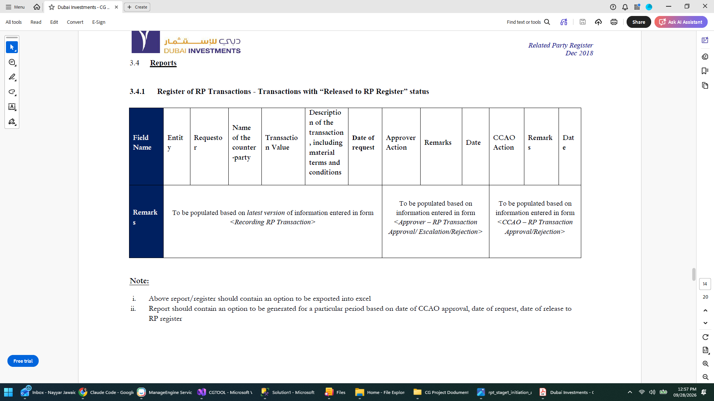

# RP Transaction reports

From **Related Party Register, Dec 2018**, §3.4 "Reports". Transcribed for the same
reason as the [field rules](rp-transaction-field-rules.md) and the
[notifications](rp-transaction-notifications.md).

## 3.4.1 Register of RP Transactions — transactions with "Released to RP Register" status

One row per released transaction. The source lays the columns out across the page; they
are listed down here, which is the same table read the other way.

| # | Column | Populated from |
| --- | --- | --- |
| 1 | Entity | To be populated based on *latest version* of information entered in form *&lt;Recording RP Transaction&gt;* (columns 1–6) |
| 2 | Requestor | |
| 3 | Name of the counter-party | |
| 4 | Transaction Value | |
| 5 | Description of the transaction, including material terms and conditions | |
| 6 | Date of request | |
| 7 | Approver Action | To be populated based on information entered in form *&lt;Approver — RP Transaction Approval / Escalation / Rejection&gt;* (columns 7–9) |
| 8 | Remarks | |
| 9 | Date | |
| 10 | CCAO Action | To be populated based on information entered in form *&lt;CCAO — RP Transaction Approval/Rejection&gt;* (columns 10–12) |
| 11 | Remarks | |
| 12 | Date | |

**Note** (verbatim):

1. Above report/register should contain an option to be exported into excel
2. Report should contain an option to be generated for a particular period based on date
   of CCAO approval, date of request, date of release to RP register

## How the app stands against this

`/rp-transactions/register` (`RpTransactionRegisterPage`) already answers both notes:
it exports to CSV, and it filters to a period on a chosen basis — date of request, date
of CCAO approval, or date of release — which is exactly the three the note names.

The **CSV export carries all twelve columns** above, plus a reference number and the
release date.

The **on-screen table carries nine of the twelve**. Three columns the spec lists are not
shown: *Description of the transaction*, *Approver Remarks* and *CCAO Remarks*. They are
in the export and in the data, just not on the page — presumably because they are long
free text in a table that is already wide. Worth deciding whether the screen should
match the spec, or whether the export is where the full register is meant to be read.
