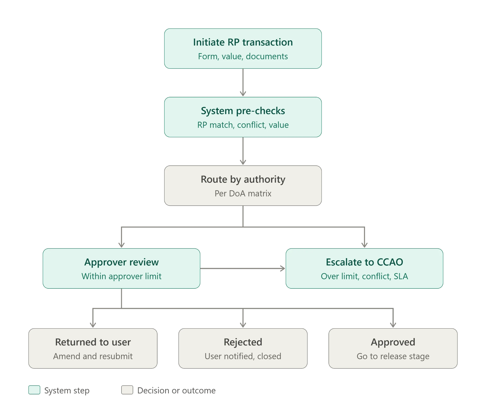
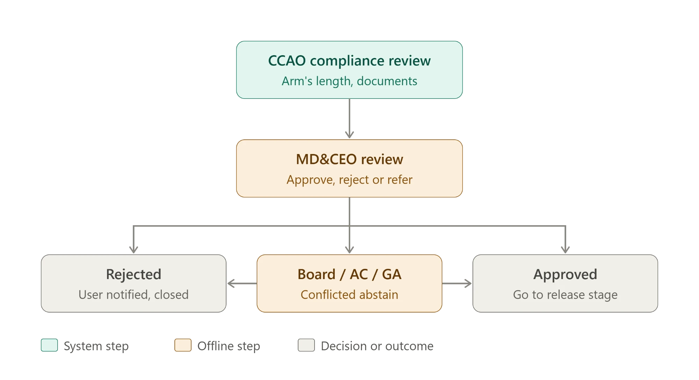
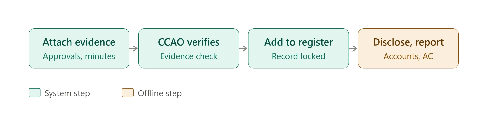

# RP Transaction workflow

The three stages a Related Party transaction moves through, as diagrams. Reference
material for the RP Transaction screens (`/rp-transactions/*`) — not something any
code reads.

| Stage | Diagram |
| --- | --- |
| 1. Initiation and routing |  |
| 2. Approval |  |
| 3. Release and disclosure |  |

**Stage 1 — initiation and routing.** The user raises the transaction (form, value,
documents); the system pre-checks it (related-party match, conflict, value); it routes
by the DoA matrix to an approver, or escalates to the CCAO when it is over the
approver's limit, carries a conflict, or breaches SLA. Outcomes: returned to the user
to amend and resubmit, rejected, or approved.

**Stage 2 — approval.** CCAO compliance review (arm's length, documents), then MD&CEO
review, which approves, rejects, or refers to the Board / Audit Committee / General
Assembly, where conflicted members abstain. Approved transactions go to the release
stage.

**Stage 3 — release and disclosure.** Evidence (approvals, minutes) is attached, the
CCAO verifies it, the transaction is added to the register and the record is locked,
and it is disclosed in the accounts and to the Audit Committee.

Green is a step the system performs, amber a step that happens offline, grey a decision
or an outcome.
